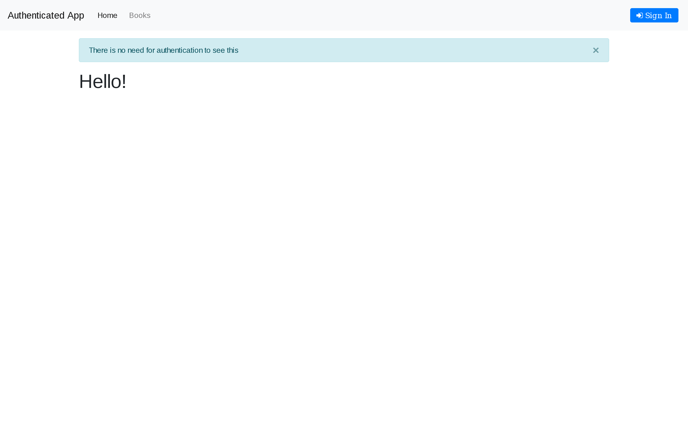
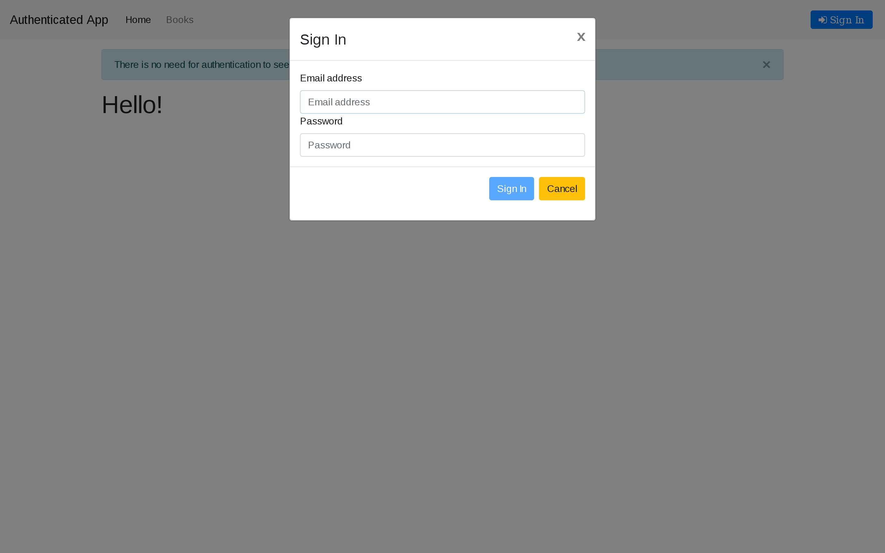
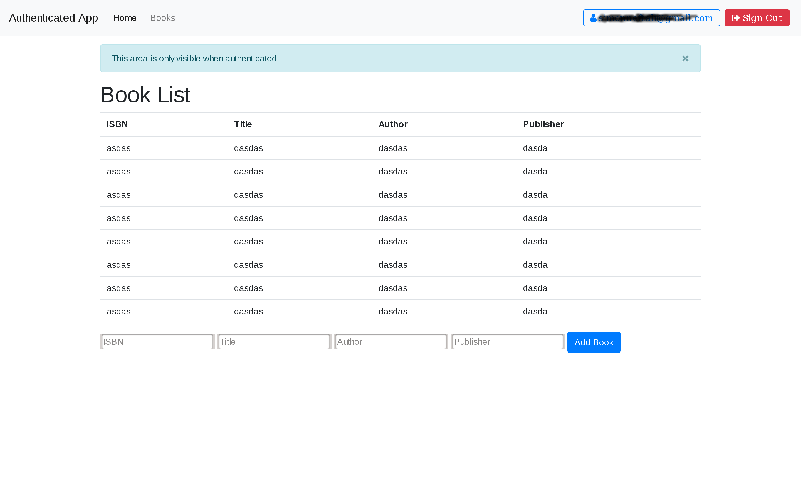
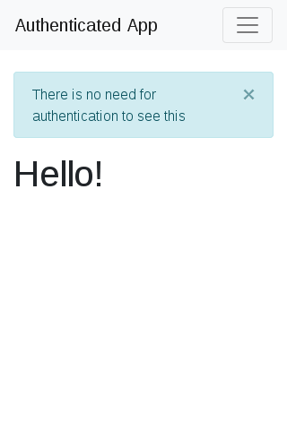
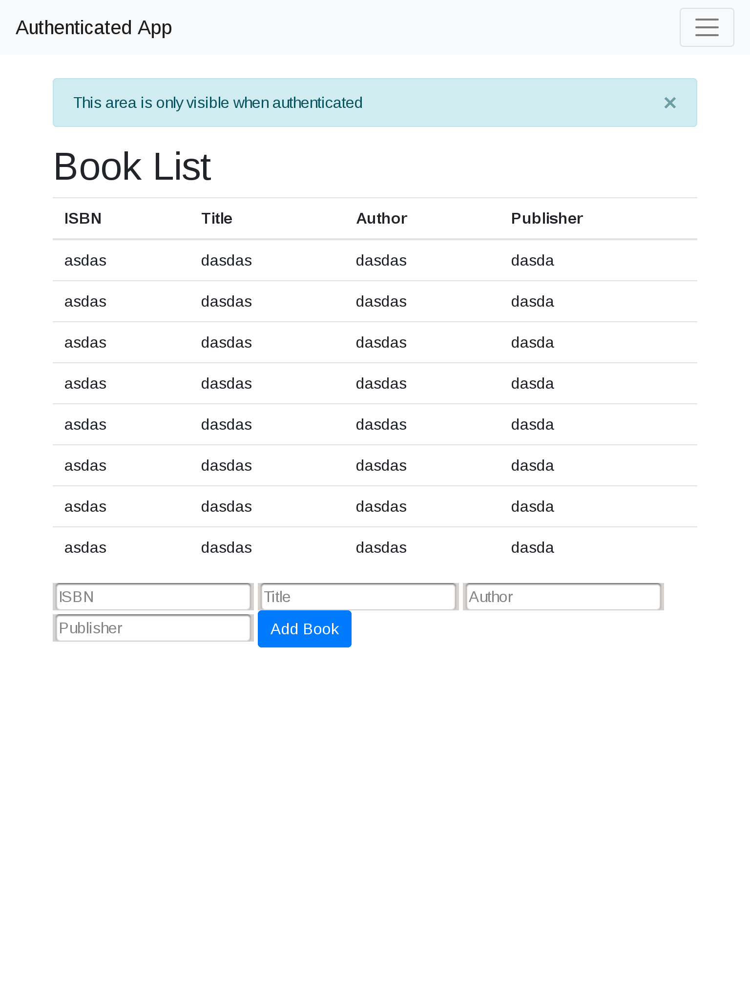

# MEAN Stack authentication example

This work is based on the tutorial [Securing MEAN Stack (Angular 5) Web Application using Passport](https://www.djamware.com/post/5a878b3c80aca7059c142979/securing-mean-stack-angular-5-web-application-using-passport)
Though I converted the Angular part to Angular JS plus added some features.

My idea is that this should be used as starting point for building other apps that require authentication.

I used Bootstrap4 for styling and also ui-bootstrap 

# Warnings 

The authentication method seems robust but since I'm no expert I can not guarantee its security,
if you can provide any hints regarding this  please open an issue

# How to use it

I'm using docker for running this app in order to not mess with my other development projects but you can also run 
the aplication alone.

## Using docker-compose

On a terminal go to the `mean-authentication` folder and run:

```shell
docker-compose up --build
```

Add a `-d` if you want to run it on the background

To re-build only the app container do:

```bash
docker-compose up -d --build app
```

## Just the app

```shell
cd [full-path-here]/mean-authentication/web_app
npm start
```

and you should get a message like this. (you need a mongodb instace running )

```shell

> web-app@0.0.0 start /full/path/will/appear/here/web_app
> node ./bin/www                                                                                                                                                                                                                             
                                                                                                                                                                                                                                             
App listening on port: 3000                                                                                                                                                                                                                  
(node:8692) DeprecationWarning: current URL string parser is deprecated, and will be removed in a future version. To use the new parser, pass option { useNewUrlParser: true } to MongoClient.connect.                                       
{ MongoNetworkError: failed to connect to server [db:27017] on first connect [MongoNetworkError: getaddrinfo ENOTFOUND db db:27017]                                                                                                          
    at Pool.<anonymous> (/full/path/will/appear/here/web_app/node_modules/mongodb-core/lib/topologies/server.js:564:11)                                                                                                 
    at Pool.emit (events.js:182:13)                                                                                                                                                                                                          
    at Connection.<anonymous> (/full/path/will/appear/here/web_app/node_modules/mongodb-core/lib/connection/pool.js:317:12)                                                                                             
    at Object.onceWrapper (events.js:273:13)                                                                                                                                                                                                 
    at Connection.emit (events.js:182:13)                                                                                                                                                                                                    
    at Socket.<anonymous> (/full/path/will/appear/here/web_app/node_modules/mongodb-core/lib/connection/connection.js:246:50)                                                                                           
    at Object.onceWrapper (events.js:273:13)                                                                                                                                                                                                 
    at Socket.emit (events.js:182:13)                                                                                                                                                                                                        
    at emitErrorNT (internal/streams/destroy.js:82:8)                                                                                                                                                                                        
    at emitErrorAndCloseNT (internal/streams/destroy.js:50:3)                                                                                                                                                                                
    at process._tickCallback (internal/process/next_tick.js:63:19)                                                                                                                                                                           
  name: 'MongoNetworkError',                                                                                                                                                                                                                 
  errorLabels: [ 'TransientTransactionError' ],                                                                                                                                                                                              
  [Symbol(mongoErrorContextSymbol)]: {} }                             
```


# Screnshots
## Large Screens
> 
> 
> 
## Small screens
Extra small screen
> 

Ipad size screen
> 
